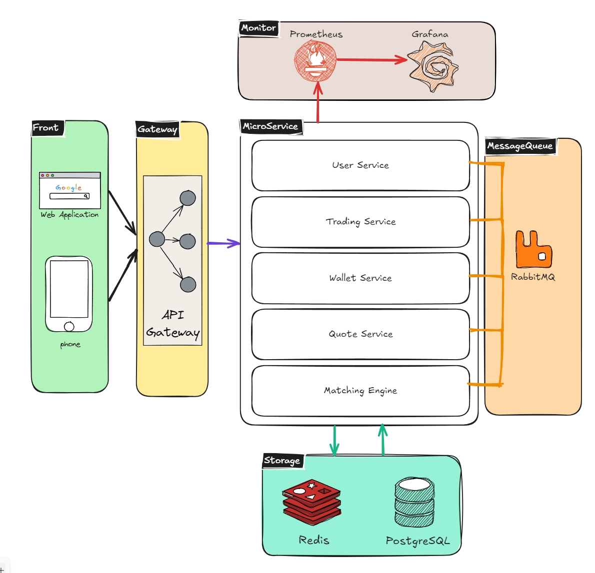
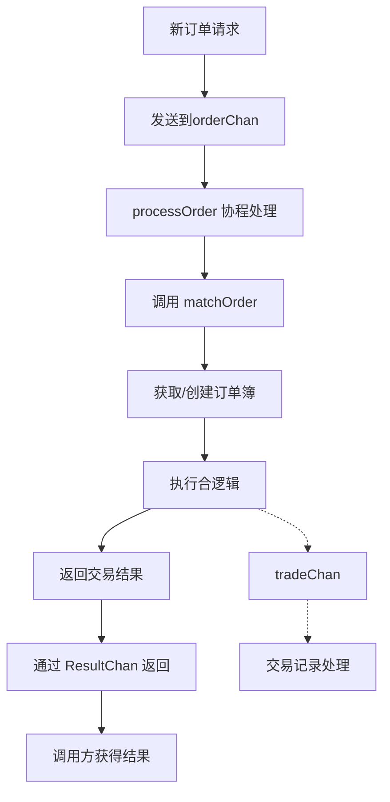
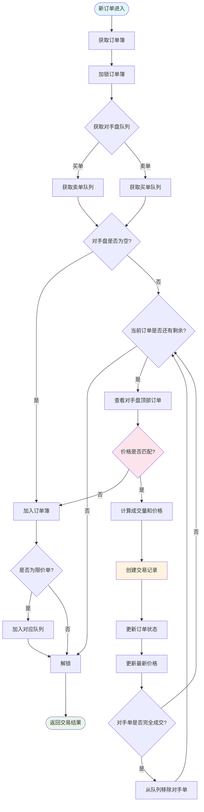
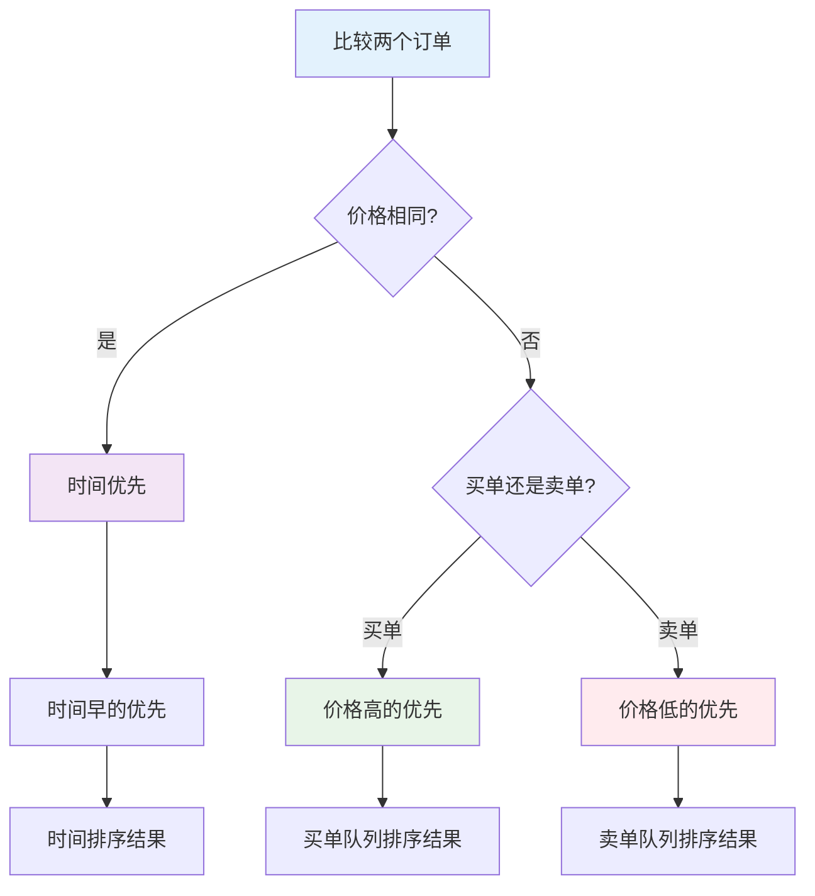
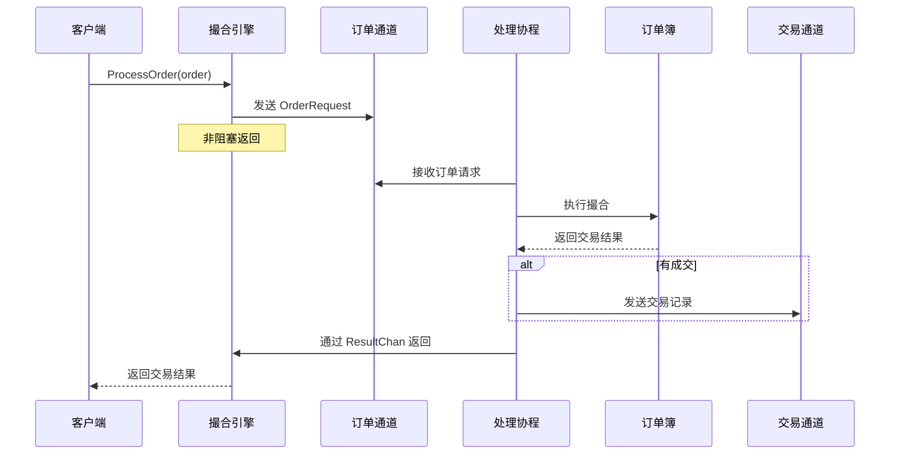

# Crypto Trading System
基本的交易系统结构（供学习）

## 项目框架


## 功能模块设计
### 撮合引擎

撮合引擎主要负责公平的撮合买卖订单、实现公平交易撮合。

#### 一、基础概念

**买单簿（Bids）：** 所有买家愿意以不同价格买入的委托单，价格从高到低（大根堆）

**卖单簿（Asks）：** 所有买家愿意以不同价格买入的委托单，价格从低到高（小根堆）

**价差（Spread）：** 只有买单价 ≥ 卖单价时，才会发生撮合

**价格-时间优先原则：**撮合时，匹配价格最优的订单（如买单优先匹配最低卖价，卖单优先匹配最高买价），如果有多个订单价格相同，则优先匹配最早提交的订单（即“先到先得”）

```bash
┌──────────────────────────────────────────────────────────────────────┐
│                        订单簿 Order Book（表格对比）                  │
├─────────────┬─────────────┬─────────────┬─────────────┬──────────────┤
│  价格优先    │  时间优先   │   方向      │   价格      │  数量(手)     │
├─────────────┼─────────────┼─────────────┼─────────────┼──────────────┤
│             │             │    ASK      │   30.50     │     200      │
│             │             │    ASK      │   30.40     │     500      │
│             │             │    ASK      │   30.30     │     300      │
│   最低卖价   │ 最早挂单    │    ASK      │   30.20     │     400 ←卖一│
├─────────────┼─────────────┼─────────────┼─────────────┼──────────────┤
│   最高买价   │ 最早挂单    │    BID      │   30.10     │     300 ←买一│
│             │             │    BID      │   30.00     │     600      │
│             │             │    BID      │   29.90     │     200      │
│             │             │    BID      │   29.80     │     100      │
└─────────────┴─────────────┴─────────────┴─────────────┴──────────────┘
价差 Spread = 30.10 - 30.20 = -0.10，不会成交，等待新的单子进来
```

**市价单（Limit Order）：**

- 指定价格：只能在指定价格或更优的价格成交
- 可能部分成交：对手盘不够
- 需要等待：会留在订单簿里

**限价单（Market Order）：**

- 立即成交：以当前市场最优价格立即成交
- 全部成交或拒绝
- 不等待：不会留在订单簿里

#### 二、设计

##### 功能组成

1. **订单簿管理模块：** 维护所有未成交的订单
2. **撮合算法模块：** 实现[价格-时间优先撮合原则](https://www.notion.so/24c18c07033380d69f83f91281277238?pvs=21)

### 结构设计

**整体框架设计：**

- 订单通道（Order Chan）：用户订单入口
- 交易通道（Trade Chan）：撮合成功订单出口
- 循环撮合处理（Process Loop）：撮合符合规则的订单
- 订单簿（Order Books Map）：管理未成交的各币对的交易簿


**单个订单簿设计：**

如下图所见，单个订单簿分为[买单簿（BuyOrders）](https://www.notion.so/24c18c07033380d69f83f91281277238?pvs=21)、[卖单簿（SellOrders）](https://www.notion.so/24c18c07033380d69f83f91281277238?pvs=21)。

```bash
OrderBook (BTC/USDT)
├── BuyOrders (最大堆)
│   ┌─────────────────┐
│   │ Price: $110,100 │ ← 堆顶 (最高价)
│   │ Amount: 0.5 BTC │
│   │ Time: 10:01:00  │
│   ├─────────────────┤
│   │ Price: $110,099 │
│   │ Amount: 1.0 BTC │
│   │ Time: 10:00:30  │
│   ├─────────────────┤
│   │ Price: $110,098 │
│   │ Amount: 0.8 BTC │
│   │ Time: 10:01:00  │
│   └─────────────────┘
│
└── SellOrders (最小堆)
    ┌─────────────────┐
    │ Price: $110,101 │ ← 堆顶 (最低价)
    │ Amount: 0.3 BTC │
    │ Time: 10:00:45  │
    ├─────────────────┤
    │ Price: $110,102 │
    │ Amount: 0.7 BTC │
    │ Time: 10:01:15  │
    ├─────────────────┤
    │ Price: $110,105 │
    │ Amount: 1.2 BTC │
    │ Time: 10:00:45  │
    └─────────────────┘
```

##### 撮合流程

**撮合框架处理流程：**

1. 新订单请求被推送到 `orderChan` 
2. 调用`ProcessOrder` 开始分配订单处理逻辑，以及结果响应逻辑（异步处理订单+同步等待结果）
3. 调用 `matchOrder` 处理订单撮合
4. 返回交易结果至 `ResultChan` ，同时将相关逻辑发送给 `tradeChan` （供其他模块的调用）



**详细撮合流程：**

1. 获取相关币对订单簿后加锁
2. 根据当前订单方向（buy/sell）获取相对的对手盘队列
    1. 如果对手盘队列为空（是），直接加入订单簿，然后进行[订单类型判断](https://www.notion.so/24c18c07033380d69f83f91281277238?pvs=21)
    2. 如果对手盘队列不对空（否），则开始判断当前订单是否**完全交易**
        1. 如果有剩余（是），则继续判断对手盘顶部订单是否匹配
            1. 如果对手单匹配上了（是），则进行创建交易、更新订单状态、更新价格，再判断对手单是否**完全交易**
                1. 如果对手单完全交易（是），则将对手单移出队列
                2. 如果对手单没有完全交易（否），则返回当前订单是否完全交易的[判断分支](https://www.notion.so/24c18c07033380d69f83f91281277238?pvs=21)
            2. 如果对手单没有匹配上（否），加入订单簿，再判断订单类型（limit/market）
                1. 限价单 limit（是）：加入对应对手盘队列，返回交易结果
                2. 市价单 market（否）：返回交易结果
        2. 如果没有剩余（否），返回交易结果



**价格-时间优先原则：**



**订单并发处理框架：**

这里直接用 go 代码说明：

采用的是 **异步+同步** 方式进行。

```go
func (e *matchingEngine) ProcessOrder(ctx context.Context, order *model.Order) ([]*model.Trade, error) {
	resultChan := make(chan *MatchResult, 1)

	// 异步处理订单：加入订单处理通道
	select {
	case e.orderChan <- &OrderRequest{Order: order, ResultChan: resultChan}:
	case <-ctx.Done():
		return nil, ctx.Err()
	}

	// 同步等待处理结果
	select {
	case result := <-resultChan:
		return result.Trades, result.Error
	case <-ctx.Done():
		return nil, ctx.Err()
	}
}

```

